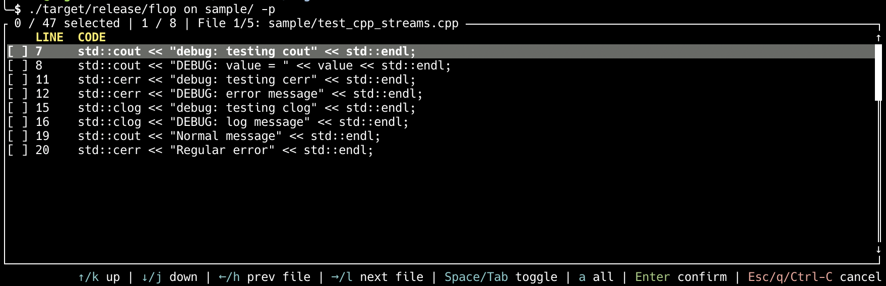

# flop

[](https://github.com/Justhiro55/flop/actions)
[](LICENSE)

**Flip output** is an interactive command-line tool that helps you manage output statements in C/C++ code.
It works by recursively searching your codebase and lets you toggle statements with an intuitive interface.



## Features

* **Interactive by default** - Beautiful TUI for selecting specific statements with file navigation
* **Fast and recursive** - Processes entire directory trees including subdirectories
* **Flexible filtering** - Detects all output functions by default, or use `--debug` to filter by keyword
* **Preview mode** - Preview changes without modifying files with `--preview`
* **Safe and reversible** - Disable output for production (`on`), enable for debugging (`off`)
* **Smart detection** - Automatically detects printf-family functions and C++ streams
* **Syntax highlighting** - Color-coded output similar to ripgrep for easy reading
* **Multiple modes** - Comment out, uncomment, or permanently delete statements

## Quick example

```bash
# Disable all output (interactive TUI by default)
$ flop on

# Disable only debug output (interactive)
$ flop on --debug

# Disable all output in batch mode (with confirmation)
$ flop on --yes

# Preview what would be changed without modifying files
$ flop on --preview src/

# Disable debug output only in batch mode
$ flop on -dy src/

# Delete all output statements permanently (interactive)
$ flop delete src/

# Process a single file
$ flop on main.c
```

## Installation

### From source

You'll need [Rust](https://www.rust-lang.org/) installed (1.70.0 or newer).

```bash
git clone https://github.com/yourusername/flop.git
cd flop
cargo build --release
```

The binary will be available at `./target/release/flop`.

### Install to system

```bash
cargo install --path .
# Or copy the binary manually
sudo cp target/release/flop /usr/local/bin/
```

## Usage

```
flop <COMMAND> [OPTIONS] [PATH]

Commands:
  off      Uncomment output statements (enable output)
  on       Comment out output statements (disable output)
  delete   Delete output statements permanently

Arguments:
  [PATH]  Path to file or directory (defaults to current directory if not specified)

Options:
  -d, --debug    Only process output statements containing 'debug' keyword
  -y, --yes      Skip interactive selection (batch mode, confirmation still required)
  -p, --preview  Preview mode - show what would be changed without modifying files
  -h, --help     Print help
```

## How it works

By default, `flop` searches for **all** C/C++ output functions in your codebase. Use the `--debug` flag to filter only statements containing "debug" or "DEBUG" keywords.

Detected output functions include:
- C standard I/O functions (printf family, puts family, write, perror)
- C++ stream operators (std::cout, std::cerr, std::clog)

**Supported file extensions:**
- `.c`
- `.h`
- `.cpp`
- `.hpp`
- `.cc`
- `.cxx`

**Detected functions:**

C standard functions:
- `printf()`, `fprintf()`, `sprintf()`, `snprintf()`, `dprintf()`
- `puts()`, `fputs()`
- `write()`
- `perror()`
- `printf_debug()`

C++ streams:
- `std::cout`
- `std::cerr`
- `std::clog`

## Examples

### Interactive mode (default)

By default, `flop` opens an interactive TUI where you can select which statements to process:

```bash
# Disable all output statements (interactive)
flop on

# Navigate with arrow keys or hjkl
# Toggle selection with Space/Tab
# Navigate between files with Left/Right arrows
# Press Enter to confirm, Esc/q to cancel
```

### Disable output in current directory

```bash
# Interactively disable all output
flop on

# Disable only debug output (interactive)
flop on --debug
```

### Enable output in a specific directory

```bash
# Interactively enable all output
flop off src/

# Enable only debug output (interactive)
flop off --debug src/
```

### Batch mode with --yes flag

Use `-y` or `--yes` to skip interactive selection and process all matched statements (confirmation still required):

```bash
# Disable all output in batch mode
flop on --yes

# Disable debug output only in batch mode
flop on -dy src/

# Enable all output in batch mode
flop off -y
```

### Process a single file

```bash
# Interactive mode
flop on main.c

# Batch mode
flop on -y main.c
```

### Delete statements permanently

```bash
# Interactive deletion
flop delete src/

# Batch deletion (confirmation required)
flop delete -y src/
```

**Warning**: This permanently removes statement lines from your files. Use with caution!

### Preview mode with --preview flag

Preview what would be changed without actually modifying any files:

```bash
# Preview changes (interactive)
flop on --preview src/

# Preview in batch mode
flop on -yp src/

# Preview debug output only
flop on -dp src/
```

Preview mode never modifies files. It's useful for:
- Checking what statements will be affected before committing
- Verifying detection patterns
- Safely exploring the tool's behavior

### Filter debug output with --debug flag

By default, `flop` detects **all** output functions. Use `--debug` to filter only statements containing "debug" or "DEBUG" keywords:

```bash
# Process only debug output (interactive)
flop on --debug

# This will detect:
# - printf("debug: message") ← detected
# - printf("Regular message") ← NOT detected with --debug
# - std::cout << "DEBUG: xyz" ← detected
```

### Cancel operation

When prompted for confirmation, type `n` to cancel without making changes:

```
Do you want to disable (comment out) these statements? (y/n): n
Operation cancelled.
```

## Building

```bash
cargo build --release
```

## Testing

The repository includes sample C files in the `tests/` and `sample/` directories for testing:

```bash
# Build the project
cargo build --release

# Navigate to the tests directory and run flop without path argument
cd tests/
../target/release/flop on

# Disable all debug statements (type 'y' to confirm)
../target/release/flop on

# Verify they are commented out
cat main.c

# Enable all debug statements (type 'y' to confirm)
../target/release/flop off

# Verify they are uncommented
cat main.c

# Go back to project root
cd ..
```

You can also test with the `sample/` directory which contains more comprehensive examples:

```bash
./target/release/flop on sample/
```

## Why use flop?

* **Speed up your workflow** - No need to manually toggle output statements
* **Interactive by default** - Beautiful TUI with file navigation makes selection intuitive
* **Avoid mistakes** - Preview mode and confirmation prompts prevent accidental changes
* **Clean commits** - Easily disable output before committing (`flop on`)
* **Quick debugging** - Enable output when investigating issues (`flop off`)
* **Production cleanup** - Permanently delete statements with the delete command
* **Safe exploration** - Use `--preview` to preview changes before applying them
* **Flexible filtering** - Process all output or filter by debug keyword with `--debug`
* **Batch automation** - Use `--yes` flag for scripts while keeping confirmation

## Why not use flop?

* **Language specific** - Only works with C/C++ code
* **Simple pattern matching** - May not catch all debug logging patterns
* **Printf-based only** - Doesn't work with logging libraries (log4c, spdlog, etc.)

## License

This project is dual-licensed under the MIT License and Apache License 2.0.

See [LICENSE](LICENSE) for details.
